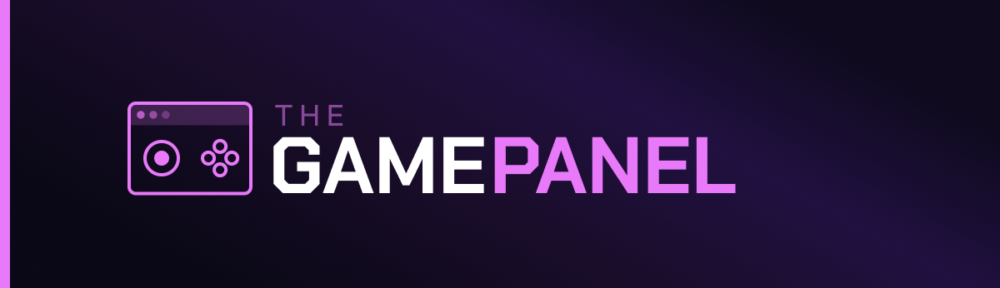

# The Game Panel

**Open-source game server management, done properly.**

The Game Panel is a modern alternative to Pterodactyl, built from the ground up to be fast, modular, and reliable. It is
currently in active development, and there are no public releases yet.

🌐 **[thegamepanel.com](https://thegamepanel.com)**

## Repositories

| Repo                                           | Description                                                                        |
|------------------------------------------------|------------------------------------------------------------------------------------|
| [panel](https://github.com/thegamepanel/panel) | The Game Panel itself - engine and application in a single repository. Start here. |

## Get Involved

- 🌐 [Visit the website](https://thegamepanel.com) - find out what The Game Panel is and where it is going
- 💬 [Join the Discord](https://discord.gg/bmRAAvWT6b) - follow the build and shape the direction
- 💖 [Sponsor the project](https://github.com/sponsors/thegamepanel) - support solo open-source development
- 📬 [Newsletter](https://buttondown.com/thegamepanel) - get updates delivered to your inbox
- 📣 [Follow announcements](https://github.com/thegamepanel/panel/releases) - stay up to date with releases
